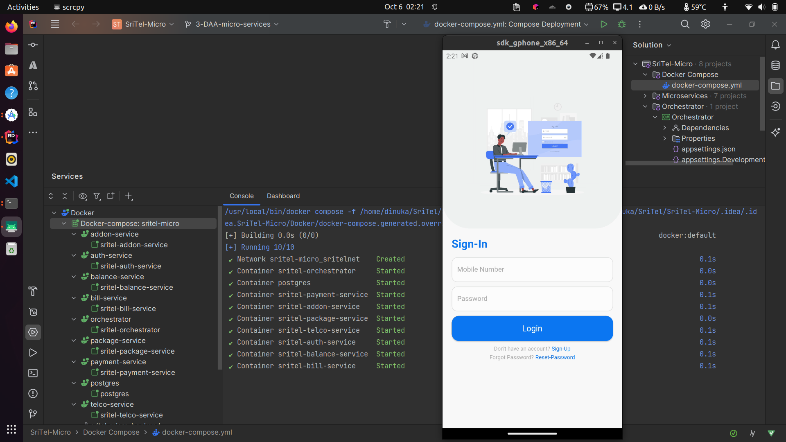

# Telecommunication App

Welcome to the Telecommunication App documentation! This Flutter-based mobile application provides users with a range of telecommunication services, including user registration and management, telco service activation and deactivation, package management, balance checks, billing information, and more.

## Table of Contents
- [Features](#features)
- [Installation](#installation)
- [Usage](#usage)
- [Screenshots](#screenshots)
- [Contributing](#contributing)
- [License](#license)

## Features

### User Registration and Sign-In
- Users can create accounts and log in securely using their credentials.
- User authentication is handled securely to protect user data.

### Telco Service Activation and Deactivation
- Users can activate and deactivate telecommunication services.
- Services can be customized based on user preferences.

### Data and Voice Package Management
- Users can add, upgrade, downgrade, and deactivate data and voice packages.
- The app provides options for various package plans and flexibility in managing subscriptions.

### Ringtone Change
- Users can personalize their experience by changing their ringtone.

### Data Add-On and Extra GB
- Users can purchase additional data and GB as needed.
- Add-on options are available to meet different usage patterns.

### Data and Voice Balance Check
- Users can easily check their data and voice balances.

### Get Last Month's Bill
- Users can view their billing information for the previous month.

### Make Payments
- Secure payment processing allows users to pay their bills.
- Overpayments are carried forward to the next billing cycle.

## Installation

1. Clone this repository to your local machine:

   ```bash
   https://github.com/SriTel/SriTel-Mobile-Client.git
   ```

2. Navigate to the project directory:
   ```bash
   cd SriTel-Mobile-Client
   ```

3. Change the BaseUrl to your backend url
   ```bash
   ./lib/util/constants.dart
   ```

4. Install the required dependencies using Flutter:
   ```bash
   flutter pub get
   ```

5. Run the app on an emulator or physical device:
   ```bash
   flutter run
   ```

## Usage

1. Register or sign in to your account.

2. Explore the app's features, including service management, package customization, balance checks, bill viewing, and payments.

3. Personalize your experience by changing your ringtone.

4. Enjoy a seamless telecommunication experience!

## Screenshots




## Contributing

We welcome contributions from the community. If you find any issues or have suggestions for improvements, please create a GitHub issue or submit a pull request. For major changes, please discuss them with the maintainers before making any modifications.

## License

This project is licensed under the MIT License. 
